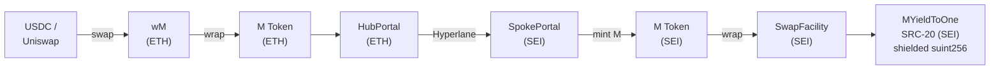
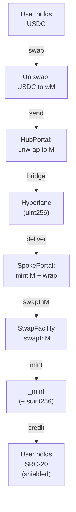
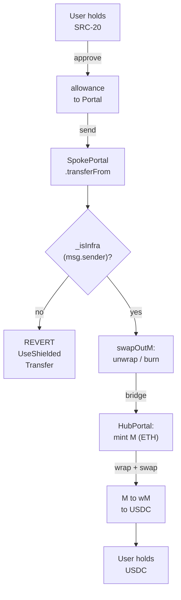
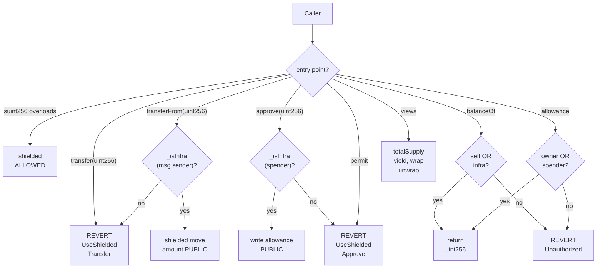
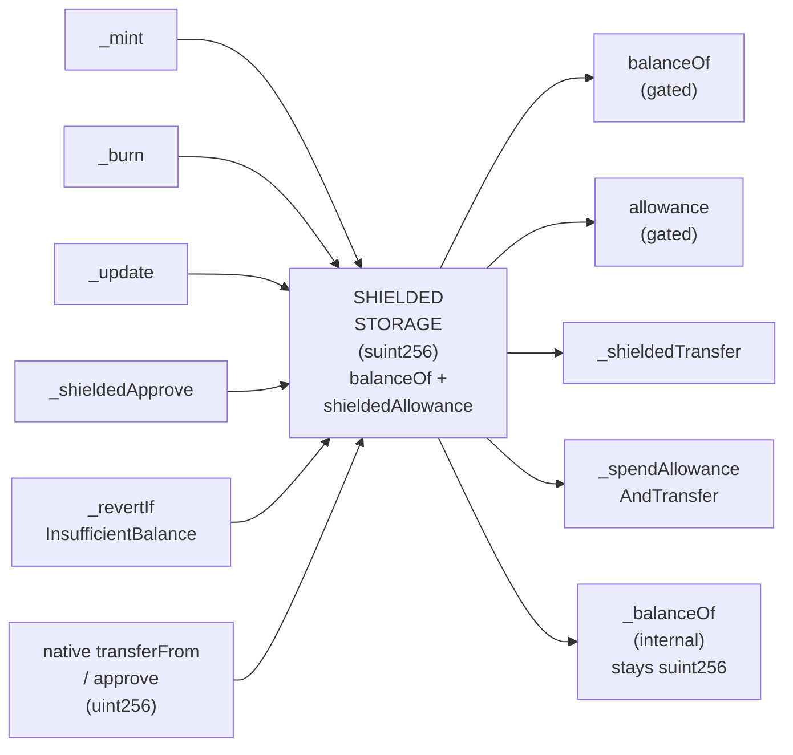

# 🔐 Seismic SRC-20 (MYieldToOne) — Flow Diagrams (implemented)

> **Seismic SRC-20 (MYieldToOne) — deployment + flow diagrams.** Design basis:
> **Path A + infra-allowlist outflow**. Unlike the earlier scoping page, the
> gated outflow path is **no longer "proposed"** — it shipped on `feat/seismic`
> as the `_isInfra` infra allowlist (commits `325a57d`, `7350fc5`, `172cb30`).
> This page recreates every diagram against the merged implementation.

Mirrors the Notion page in the Scratchpad. Mermaid node labels are kept short
(broken with ` `) so they don't overflow in renderers; the polished
Excalidraw export uses native bound text in the hand-drawn Excalifont.

## How to read these

- **Color legend:** `Blue` = unchanged M0 infra / public `uint256` rails ·
  `Purple` = shielded (`suint256`) space · `Teal` = infra-allowlist gate
  (`_isInfra`) / Seismic signed read · `Orange` = external front-end (USDC /
  Uniswap) · `Green` = allowed / end state · `Red` = revert / blocked.

---

## D1 — Deployment Topology

**Polished:** [Open D1 in Excalidraw](https://excalidraw.com/#json=WKVDZQ6MGulx3rSSduoRK,zGZgC28NlOORKPjI_M3YmQ) · checkpoint `a4384d5745ed40bea1`

M0 deploys on Seismic exactly as on any spoke — `SpokePortal`, M Token,
`SwapFacility`, `Registrar` are standard and unchanged. The only modified
contract is **MYieldToOne**, compiled with `ssolc` for the mercury EVM so it can
hold shielded `suint256` balances. The hub–spoke link is the standard Hyperlane
bridge, carrying a public `uint256` amount.

---

## D2 — Inflow: USDC → SRC-20

**Polished:** [Open D2 in Excalidraw](https://excalidraw.com/#json=N7Id9m00KiOgM1JPR6VtW,huOVE-svzy8l9A8yvE6LYA) · checkpoint `02c76cd6a006490f94`

A USDC holder swaps to wM on Uniswap, then bridges via `HubPortal` (which
unwraps to M). Hyperlane delivers to Seismic, where `SpokePortal` mints M and
wraps it through `SwapFacility.swapInM` into MYieldToOne. The **only
public→shielded cast is in `_mint`** (`MYieldToOne.sol:369`). Inflow needs
**zero M-stack changes** and never reads `balanceOf`.

---

## D3 — Outflow: SRC-20 → USDC (now ENABLED)

**Polished:** [Open D3 in Excalidraw](https://excalidraw.com/#json=a2VEro6B4wGt0t8mjRRUv,v8NIhn0231Nu8EyLXbvjgQ) · checkpoint `b32edb9dcd60439abd`

Outflow is the mirror of inflow, and it **now works on the branch**. The user's
SRC-20 is pulled via the standard `uint256` `transferFrom`, which the contract
re-enables only for trusted M0 infra: `_isInfra(msg.sender)` must hold
(`MYieldToOne.sol:208`), otherwise it reverts `UseShieldedTransfer`. With Portal
allowlisted and `SwapFacility` permanently exempt (the immutable),
`SwapFacility.swapOutM` unwraps/burns the SRC-20, Hyperlane bridges back, and M
→ wM → USDC on Uniswap completes the exit. Private p2p stays on
`transfer(suint256)`; only bridge amounts go public.

The outbound path touches the extension's public surface **3 times** (all
`uint256`, all infra-gated):

| # | Call on the extension | gate predicate |
|---|---|---|
| a | `transferFrom(user → Portal)` | `msg.sender` = Portal (allowlisted) |
| b | `approve(SwapFacility)` via `forceApprove` | `spender` = SwapFacility (immutable) |
| c | `transferFrom(Portal → SF)` in `swapOutM` | `msg.sender` = SwapFacility (immutable) |

Note that **(b) gates on the spender**, not the caller (`MYieldToOne.sol:222`):
that is exactly why a holder can grant the allowance with the native
`approve(uint256)` as long as the spender is infra, and why Portal's
`forceApprove(SwapFacility)` is accepted.

---

## D4 — SRC-20 Function Surface

**Polished:** [Open D4 in Excalidraw](https://excalidraw.com/#json=lAEd7Gp5CWYn1UxDs-h3a,DEZcSSRv6rtKzc68fRph9Q) · checkpoint `48248a27ccc2451398`

The SRC-20 keeps the full ERC20 ABI. The inherited `uint256` `transfer` and
both `permit` overloads **always revert** (`:192`, `:229`, `:242`). The native
`uint256` `transferFrom` / `approve` are **infra-gated**: `transferFrom` checks
`_isInfra(msg.sender)` (`:208`), `approve` checks `_isInfra(spender)` (`:222`);
each shares the `shieldedAllowance` slot with its `suint256` overload via an
ABI-boundary cast, so the two paths cannot diverge. `balanceOf` is readable by
the holder **or any infra** (`:262`); `allowance` only by `owner`/`spender`,
**with no infra exemption** (`:278`) — external clients use a Seismic signed
read (TxSeismic `0x4A`); plain `eth_call` zeroes `msg.sender` and reverts.
`totalSupply` / `yield` and `wrap` / `unwrap` are unchanged.

---

## D5 — Casting Boundary (suint256 / uint256)

**Polished:** [Open D5 in Excalidraw](https://excalidraw.com/#json=UBuaZT6jkAJGGxnocSBDu,okv3S_GU_2El1ItvcU-PuA) · checkpoint `5b163a4cbc1a438ea1`

Every crossing of the shielded boundary is an **explicit cast** (Seismic has no
implicit `suint256` / `uint256` conversion). Writes wrap `uint256` → `suint256`
(left: `_mint`, `_burn`, `_update`, `_shieldedApprove`,
`_revertIfInsufficientBalance`, and the native infra-gated
`transferFrom`/`approve` casting at the ABI boundary). Reads cast back out
(right: `balanceOf`, `allowance`, `_shieldedTransfer`,
`_spendAllowanceAndTransfer`'s infinite-allowance check). The internal
`_balanceOf` returns the raw `suint256` and **does not cast**. Events stay
public and revert payloads are zeroed — `InsufficientBalance(acct, 0, amt)` /
`InsufficientAllowance(spender, 0, amt)` — so no shielded value leaks.

---

## What shipped (the infra allowlist — formerly "proposed")

Changes are confined to the MYieldToOne extension and its interface — **no
M-stack edits**:

1. **Storage:** an `allowlist` mapping of trusted M0 infra
   (`MYieldToOne.sol:31`) plus the `shieldedAllowance` mapping (`:26`). The
   `swapFacility` immutable is permanently exempt without a slot.
2. **`_isInfra(account)` = `account == swapFacility || allowlist[account]`**
   (`:503`) — the single predicate gating the native paths and the `balanceOf`
   read.
3. **`transferFrom(address,address,uint256)`** — reverts unless
   `_isInfra(msg.sender)`, then casts to `suint256` and runs the shielded
   transfer (`:203`).
4. **`approve(address,uint256)`** — reverts unless `_isInfra(spender)`, then
   writes the shielded allowance (`:218`). Gating the **spender** is what lets
   Portal's `forceApprove` and holder-initiated infra approvals work.
5. **`balanceOf`** — gained an infra exemption: holder **or** infra may read
   cleartext (`:262`), so shared infra (e.g. LimitOrderProtocol) can observe
   balances for paths it controls. `allowance` did **not** get this exemption.
6. **`transfer(address,uint256)`** and both `permit` overloads stay reverting
   (`:192`, `:229`, `:242`).
7. **Admin:** `setAllowlisted(address,bool)` + batch overload (`:152`, `:157`),
   role-gated to `DEFAULT_ADMIN_ROLE`, emitting `AllowlistSet`. Allowlist Portal
   at deploy; SwapFacility rides the immutable.

**Deltas from the original scoping spec:** (i) `approve` gates on the spender,
not the caller; (ii) `balanceOf` gained an infra read-exemption; (iii) one
unified `_isInfra` allowlist now covers native `approve`/`transferFrom` **and**
`balanceOf`, rather than a transfer-only operator list.

**Privacy tradeoff:** infra-mediated amounts are public (calldata + `Transfer`
event) — acceptable, since they are bridge/unwrap amounts that are public on the
other chain anyway. User-to-user transfers stay private on `transfer(suint256)`.

## Source

- Notion page: https://www.notion.so/36b858df176a816b97ebe31e0c98be29
- `src/projects/yieldToOne/MYieldToOne.sol`
- `src/projects/yieldToOne/interfaces/IMYieldToOne.sol`
- Branch `feat/seismic`; commits `325a57d`, `7350fc5`, `172cb30`.
